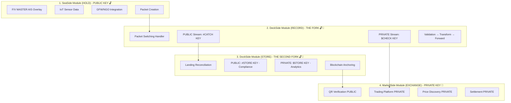

# SeaTrace-ODOO Enterprise Integration Suite

<div align="center">


**🌊 Transforming Seafood Supply Chain Management Through Blockchain-ERP Integration**

*Integrating SeaTrace's Four Pillars Architecture with ODOO's Enterprise Financial Infrastructure*

</div>

---

## 🎯 Executive Summary

The **SeaTrace-ODOO Enterprise Integration Suite** combines SeaTrace's blockchain-powered seafood traceability platform with ODOO's world-class ERP system. This integration delivers **TRUSTED INTERNATIONAL FISHERIES SUPPLY INDUSTRY ACCOUNT INFORMATION SYSTEMS** for the global seafood MARKETPLACES COMMUNICATIONS NETWORK.

### 💰 Value Proposition
- **$4.2M USD Stack Valuation** - Production-ready marine intelligence platform
- **Enterprise-Grade Financial Management** - ODOO 19.0+ accounting integration
- **Blockchain Traceability** - Immutable audit trails from sea to plate
- **Global Compliance** - Automated regulatory reporting and verification

---

## 🏗️ Four Pillars Architecture + ODOO Integration


```

### ODOO Integration Points

Each SeaTrace pillar integrates with corresponding ODOO modules for enterprise financial management:

```
┌─────────────────┐    ┌──────────────────┐
│   SeaSide       │◄──►│ ODOO Account     │  📂 PUBLIC KEY
│   (HOLD)        │    │ Module           │  🔓 Unlimited License
└─────────────────┘    └──────────────────┘
         │                       │
         ▼                       ▼
┌─────────────────┐    ┌──────────────────┐
│   DeckSide      │◄──►│ ODOO Stock       │  📂 DUAL KEYS
│   (RECORD)      │    │ Account          │  🔓🔐 PUBLIC + PRIVATE
└─────────────────┘    └──────────────────┘
         │                       │
         ▼                       ▼
┌─────────────────┐    ┌──────────────────┐
│   DockSide      │◄──►│ ODOO Inventory   │  📂 DUAL KEYS
│   (STORE)       │    │ Management       │  🔓🔐 PUBLIC + PRIVATE
└─────────────────┘    └──────────────────┘
         │                       │
         ▼                       ▼
┌─────────────────┐    ┌──────────────────┐
│   MarketSide    │◄──►│ ODOO Sales &     │  � DUAL KEYS
│   (EXCHANGE)    │    │ Purchase         │  🔓� PUBLIC + PRIVATE
└─────────────────┘    └──────────────────┘
```

### Pillar Details

#### 🌊 **1. SeaSide (HOLD)** - Vessel Operations | PUBLIC KEY 🔓
**Function:** F/V MASTER AIS overlay tracking vessels at THREE CRITICAL TRIP MOMENTS

**🚨 THE STARTING POINT for all SeaTrace data flows**

SeaSide is NOT about "catch recording" (that's DeckSide's job). This module creates the **foundation packets** from IoT sensor data captured at sea, using **NGO/Global Fishing Watch API integration** for vessel identity verification and behavior analysis.

**Three Key Trip Moments (F/V MASTER AIS Overlay):**
1. **BEFORE LEAVING:** Vessel position verification at dock, trip initialization, IoT sensor calibration
2. **ON THE WAY BACK:** Return voyage tracking, approximate position PING events (FAO zone level)
3. **ARRIVING AT PORT:** Final approach monitoring, landing preparation, packet finalization

**Microservice Capabilities:**

**NGO/GFW API v3 Integration:**
- **Vessel Search:** Identity verification via IMO numbers, vessel name matching
- **Position Tracking:** AIS data ingestion with gap detection (flags >4 hour reporting gaps as suspicious)
- **Fishing Events:** Port visits, fishing activity, encounters with other vessels
- **Behavior Analysis:** Tracks fishing hours, protected area violations, suspicious patterns
- **Rate Limiting:** Async client with 10 concurrent requests max, 100ms intervals, 429 retry handling

**Packet Creation Workflow:**
```
IoT Sensors → Data Aggregation → GFW Enrichment → Packet Assembly → DeckSide Routing
```

**Technical Implementation:**
- `GFWIntegrator` async client (Python aiohttp) with asyncio.Semaphore rate limiting
- `NGOAgent` handles data access requests, compliance checks, trust scores
- Vessel size categorization: SMALL (<15 MT) vs LARGE (≥15 MT) determines regulatory requirements
- Prometheus metrics: GFW_REQUEST_COUNT, GFW_ERROR_COUNT, GFW_REQUEST_DURATION

**ODOO Integration:** Account module for vessel operational costs and crew payroll

**Commons Good Commitment:** ✅ FREE forever - Transparent vessel operations

**PUBLIC Data Exposed (F/V MASTER):**
- **Approximate GPS:** FAO zone level only (e.g., "FAO Zone 77 - Georges Bank")
- **Trip Metadata:** Start/end times, vessel IMO numbers, basic IoT sensor readings (temperature, salinity)
- **Public PING Events:** Timestamped position reports at zone level
- **Species Estimates:** Visual identification (e.g., "Atlantic Cod") WITHOUT precise counts

**PRIVATE Data Hidden ($CHECK KEY):**
- Precise 6-decimal GPS coordinates ("honey holes")
- Exact fish counts and weight measurements
- ML quality predictions and prospectus pricing
- Proprietary fishing pattern analytics

---

#### � **2. DeckSide (RECORD)** - THE CRITICAL FORK | DUAL KEY 🔓🔐
**Function:** Catch verification and the PUBLIC/PRIVATE data split point

**🚨 THIS IS WHERE THE FORK HAPPENS:**

DeckSide is the **central innovation** ($4.2M → $10M+ valuation driver) where catch data splits into two parallel streams:

**PUBLIC STREAM - #CATCH KEY (Commons Good)** 🔓
- **Estimated Weight:** Deckhand tally with ~5-10% margin of error
- **Basic Species ID:** Visual identification (e.g., "Atlantic Cod")
- **Approximate Count:** Estimated fish count for SIMP compliance
- **Simple Grading:** Pass/Fail or basic A/B/C visual grades

**PRIVATE STREAM - $CHECK KEY (Investor Value)** 🔐
- **Prospectus Pricing:** ML-powered valuation (e.g., $25,400 catch prospectus)
- **Exact Count:** Precise fish-by-fish counting (e.g., 392 fish vs. ~400)
- **ML Quality Scores:** 94.2% Grade A confidence predictions
- **ROI Analytics:** 70.1% return potential calculations
- **Precise GPS:** 6-decimal fishing "honey holes" (F/V CAPTAIN coordinates)

**Packet Switching Handler:**
- Validates incoming catch packets from SeaSide
- Transforms data through PUBLIC (#CATCH) and PRIVATE ($CHECK) pipelines
- Routes approximate data to PUBLIC APIs, precise data to PRIVATE dashboards

**ODOO Integration:** Stock Account module with dual valuation layers

**Commons Good Commitment:** ✅ PUBLIC #CATCH KEY FREE forever | 💰 PRIVATE $CHECK KEY monetized

---

#### 🏭 **3. DockSide (STORE)** - Storage Operations | DUAL KEY 🔓🔐
**Function:** Landing reconciliation and cold chain verification with advanced analytics

**🚨 WHERE ESTIMATES MEET REALITY + ECONOMIES OF SCALE**

DockSide is where the **#CATCH KEY estimated data** from DeckSide gets reconciled against **actual landed weights** and cold storage realities. This module validates that what was reported at sea matches what physically arrived at the dock.

**THIS IS THE SECOND FORK** - DockSide splits into PUBLIC compliance tracking vs. PRIVATE inventory optimization and predictive analytics.

**Landing Reconciliation Workflow:**
```
DeckSide PUBLIC Packet (~1200 lbs estimated)
       ↓
Vessel Arrival at Port
       ↓
Physical Unloading & Weighing (actual: 1,180 lbs)
       ↓
Variance Analysis (-20 lbs, -1.67% acceptable)
       ↓
Blockchain Anchoring (immutable verified record)
       ↓
Storage Assignment (cold chain tracking begins)
```

**Microservice Capabilities:**

**PUBLIC STREAM - #STORE KEY (Commons Good)** 🔓

**Landing Records Management:**
- **Arrival Verification:** Match vessel IMO from SeaSide F/V MASTER PING with physical dock arrival
- **Unloading Documentation:** Bill of lading, customs declarations, inspector sign-offs
- **Weight Reconciliation:** Compare DeckSide #CATCH estimates with certified scale readings
- **Variance Thresholds:** Flag catches with >5% weight variance for audit review

**Storage Assignment Logic:**
- **Species-Based Zoning:** Segregate high-value species (tuna, swordfish) from commodity species (cod, haddock)
- **Temperature Requirements:** -20°C for long-term frozen, -2°C to +2°C for fresh/chilled
- **Grade Segregation:** Keep Grade A separate from Grade B/C to prevent cross-contamination perception
- **FIFO Tracking:** First-in-first-out inventory management for perishable goods

**Cold Chain Monitoring:**
- **IoT Sensor Network:** Temperature, humidity, door open/close events every 5 minutes
- **Alert Thresholds:** Immediate alert if temperature deviates ±2°C from target for >15 minutes
- **Blockchain Anchoring:** Hourly temperature snapshots written to immutable audit trail
- **Compliance Reporting:** Automated HACCP logs for regulatory inspections

**Quality Verification:**
- **Visual Inspection:** Final grading to confirm/adjust DeckSide visual classifications
- **Lab Testing:** Random sampling for species DNA verification (prevent fraud/mislabeling)
- **Defect Documentation:** Photo evidence of damage, spoilage, or quality issues
- **Grade Adjustment:** Downgrade catches that deteriorated during transport

---

**PRIVATE STREAM - $STORE KEY (Investor Value)** 🔐

**Fish Ticket Indexing & Intelligence:**
- **ML-Powered Classification:** Species identification by size/weight factors with 96% accuracy
- **Commercial Species Profiling:** Automatic indexing by market value, seasonal demand, regulatory status
- **Weight-to-Count Conversion:** Predict exact fish counts from aggregate weights using ML models
- **Historical Pattern Analysis:** Track vessel landing patterns, predict future supply

**Predictive Analytics:**
- **Spoilage Risk Scoring:** ML models predict deterioration risk (94% accuracy)
- **Optimal Storage Duration:** Calculate max shelf life based on catch quality, handling, temperature
- **Grade Degradation Forecasting:** Predict when Grade A will drop to Grade B (±2 day accuracy)
- **Yield Optimization:** Recommend processing timing for maximum fillet recovery

**Economies of Scale Cost Savings:**
- **Bulk Storage Optimization:** Reduce cost/lb by 33% ($0.12 → $0.08) through intelligent space allocation
- **Energy Efficiency:** Dynamic temperature control saves 18% on cold storage energy costs
- **Labor Optimization:** Automated inventory tracking reduces manual checking by 60%
- **Insurance Savings:** Real-time monitoring + blockchain audit trail = 12% lower premiums

**Supply Chain Building (Raw → Finished Product):**
- **Finished Product Tracing:** Track individual fillet → retail package chain
- **Processing Yield Analytics:** Calculate actual vs. expected yield by species, grade, vessel
- **SKU-Level Inventory:** Manage finished goods (fillets, steaks, portions) with full traceability
- **Retail Package QR Codes:** Generate consumer-facing QR codes linked to catch blockchain record

**Advanced Reporting:**
- **Cold Chain HACCP Dashboards:** Real-time compliance visualization for inspectors
- **Grade Adjustment Trends:** Identify vessels/handling practices that maximize quality retention
- **Inventory Turnover Metrics:** FIFO effectiveness, dead stock identification, reorder triggers
- **Cost Per Pound Analytics:** Comprehensive P&L by species, vessel, season, storage duration

**ODOO Integration:** Inventory Management module for warehouse operations

**Commons Good Commitment:** ✅ PUBLIC #STORE KEY FREE forever | 💰 PRIVATE $STORE KEY monetized

**Why This Matters:**
- **Warehouse Operators:** FREE basic compliance + cold chain monitoring
- **Processors:** Pay for predictive analytics that save 6.5× subscription cost through economies of scale
- **Regulators:** FREE access to HACCP logs and blockchain audit trails
- **Retail Buyers:** Pay for finished product tracing and SKU-level inventory intelligence

**Monetization Impact:**
- **Cost Savings:** $0.08/lb storage (vs $0.12 retail) = 33% reduction
- **Spoilage Prevention:** 8% → 3% waste = 5% yield improvement
- **Customer ROI:** $499/month subscription saves $45,000/year = 651% return

---

#### 💰 **4. MarketSide (EXCHANGE)** - Trading Platform | PRIVATE KEY 🔐
**Function:** B2B trading with PUBLIC QR verification + PRIVATE dynamic pricing

**🚨 THE DUAL-TRACK MARKETPLACE**

MarketSide serves TWO completely different user experiences depending on which key you hold:

---

### **PUBLIC TRACK - QR Verification (Commons Good)** 🔓

**Purpose:** Consumer confidence, brand transparency, regulatory compliance

**QR Code Scan Experience:**
```
Consumer scans QR code on seafood package
       ↓
Displays PUBLIC #CATCH KEY traceability chain:
  - Vessel IMO: IMO 9876543 (F/V MASTER public ID)
  - Catch Date: January 15, 2025
  - Approximate Location: FAO Zone 77 - Georges Bank
  - Species: Atlantic Cod (Gadus morhua)
  - Estimated Weight: ~1200 lbs (DeckSide #CATCH)
  - Actual Landed Weight: 1,180 lbs (DockSide reconciliation)
  - Grade: B (visual inspection)
  - Storage: Cold storage #12, -20°C maintained
  - Blockchain Anchor: 0x7a3f2... (immutable audit trail)
```

**Free Features:**
- Basic traceability chain (vessel → dock → storage → retail)
- Blockchain verification link
- Species identification and catch location (FAO zone level)
- Cold chain compliance status (pass/fail)
- Sustainability certifications (MSC, ASC badges)

**Use Cases:**
- Restaurant menus: "Scan to see where your fish came from!"
- Retail packaging: Build consumer trust with transparency
- NGO verification: Confirm legal catch from permitted zones
- Customs/border control: Rapid compliance verification

---

### **PRIVATE TRACK - Trading Platform (Monetized)** 🔐

**Purpose:** B2B marketplace with ML-powered pricing and financial settlement

**Buyer Dashboard Experience ($CHECK KEY Required):**
```
Logged-in buyer (subscription active) sees:
  - Real-time Inventory Feed: 1,180 lbs Atlantic Cod, Grade A (ML 94.2% confidence)
  - Prospectus Pricing: $25,400 ask ($21.53/lb with Grade A premium)
  - ROI Analytics: 70.1% margin potential for high-end restaurants
  - Precise GPS: 42.123456°N, -70.987654°W (fishing grounds intelligence)
  - Historical Data: This vessel's catch quality trends over 6 months
  - Market Intelligence: Current spot prices, seasonal demand forecasts
```

**Premium Features ($CHECK KEY):**
- **Dynamic Pricing Engine:** Real-time spot market rates + sustainability premiums
- **ML Quality Predictions:** Computer vision grading confidence scores (not just visual Pass/Fail)
- **Buyer Pre-Purchase Verification:** Photo evidence, lab test results, exact counts
- **Competitive Intelligence:** Fishing grounds data, vessel performance trends
- **Automated Settlement:** Smart contract-based payment processing, escrow, insurance claims
- **Advanced Analytics:** Species demand forecasting, price arbitrage opportunities, inventory optimization

**Trading Workflow:**
```
1. Seller Lists Catch → Prospectus generated ($25,400 ask)
2. Buyers Browse Private Feed → Filter by species/grade/location/price
3. Buyer Submits Bid → $24,800 offer with delivery terms
4. Seller Accepts/Counters → Negotiation or instant accept
5. Smart Contract Executes → Payment to escrow, delivery scheduled
6. Quality Confirmation → Buyer inspects upon delivery
7. Settlement → Funds released to seller, blockchain record finalized
```

**Subscription Tiers:**
- **Buyer Basic:** $499/month - Access to trading platform, standard pricing
- **Buyer Premium:** $1,299/month - ML analytics, precise GPS, historical trends
- **Seller Standard:** 2.5% transaction fee - List catches, accept bids
- **Seller Pro:** 1.5% transaction fee + $299/month - Priority listing, marketing tools
- **Enterprise:** Custom pricing - White label, API access, bulk discounts

---

### **Technical Architecture**

**PUBLIC QR System:**
- Static QR codes generated at packaging time
- Links to `https://verify.seatrace.com/{catch_id}` (PUBLIC endpoint)
- Serverless function fetches #CATCH KEY data from blockchain
- No authentication required (public good)
- Rate limited: 1000 scans/hour per IP (prevent scraping)

**PRIVATE Trading Platform:**
- JWT authentication with $CHECK KEY scope validation
- Subscription status checked on every API call (active/expired)
- Rate limiting: 10,000 API calls/month (Basic), 100,000/month (Premium)
- WebSocket real-time price updates for Premium subscribers
- Encrypted GPS coordinates (decryption key only for verified buyers)

**Price Discovery Algorithm (PRIVATE):**
```python
def calculate_prospectus_price(catch_data, market_data):
    base_price = market_data.spot_price[catch_data.species]
    ml_grade_premium = catch_data.quality_prediction.confidence * 0.15
    sustainability_premium = 0.10 if catch_data.certifications else 0
    scarcity_multiplier = 1 / market_data.current_supply_ratio
    
    prospectus = base_price * (1 + ml_grade_premium + sustainability_premium) * scarcity_multiplier
    return prospectus
```

---

**ODOO Integration:**

**Sales & Purchase Modules:**
- **PUBLIC QR:** No ODOO integration (static verification, no transactions)
- **PRIVATE Trading:** Full ERP integration
  - Sale Orders: Automatically created when buyer bid accepted
  - Purchase Orders: Seller's catch becomes saleable inventory
  - Receivables: Automated invoicing with payment tracking
  - Settlement: Bank reconciliation when smart contract releases funds

**Example ODOO Flow (PRIVATE):**
```
1. Catch Listed → Creates draft Sale Order in ODOO ($25,400 value)
2. Bid Accepted → Confirms Sale Order, sends invoice to buyer
3. Payment Escrow → Records as "Prepayment" in Chart of Accounts
4. Quality Confirmation → Finalizes sale, moves funds from escrow to revenue
5. Settlement → Bank reconciliation, updates Cash at Bank account
```

---

**Commons Good Commitment:**

✅ **QR Verification (PUBLIC):** FREE forever - Consumer transparency tool  
💰 **Trading Platform (PRIVATE):** Subscription-based - B2B marketplace for industry professionals

**Why This Matters:**
- **Consumers:** Get free traceability (scan QR codes, verify authenticity, zero cost)
- **Regulators/NGOs:** Free access to compliance data (#CATCH KEY public chain)
- **Buyers/Traders:** Pay for competitive advantages (ML pricing, GPS intelligence, ROI analytics)
- **Sellers/Fishermen:** List catches for free (only pay transaction fees on successful sales)

**Monetization Strategy:**
- Transaction fees (1.5-2.5%) fund FREE infrastructure (SeaSide/DeckSide/DockSide)
- Subscription revenue funds platform R&D and ML model improvements
- Cross-subsidy model: B2B traders pay, consumers/regulators benefit for free

---

## 🔐 Dual Licensing Strategy

> **Licensing at a glance:**  
> • **Free (PUL)** — Sea/Deck/Dock endpoints only. No token needed for public routes, or pass the signed PUL token.  
> • **Paid (PL)** — MarketSide. Feature-gated + quotas. Learn more in [PUBLIC-UNLIMITED.md](docs/licensing/PUBLIC-UNLIMITED.md) and [PRIVATE-LIMITED.md](docs/licensing/PRIVATE-LIMITED.md).

**PUBLIC KEY IS FREE, PRIVATE KEY IS MONETIZED**

### 🌊 Commons Charter

SeaTrace is committed to **keeping SeaSide PUBLIC endpoints free forever** as a public good, while **3 monetized pillars** (DeckSide, DockSide, MarketSide) cross-subsidize the FREE infrastructure through packet switching handler innovation. Our [Commons Charter](docs/COMMONS_CHARTER.md) guarantees:

✅ **No Retroactive Paywalls** - FREE endpoints stay free  
✅ **Transparent Funding** - 3 PRIVATE tier subscriptions fund 1 FREE tier (34:1 cross-subsidy ratio)  
✅ **Monthly Reporting** - Public Commons Fund metrics at `/api/commons/fund`  
✅ **Community Governance** - 90-day notice for any scope changes  

**How it works:** DeckSide, DockSide, and MarketSide PRIVATE subscriptions generate $120K/month revenue, funding $3.3K/month PUBLIC infrastructure costs. See real-time Commons Fund coverage at our [transparency dashboard](https://metrics.seatrace.worldseafoodproducers.com/commons).

**Business Model Economics:**
- **SeaSide:** PUBLIC only (MVP foundation, strategic loss leader)
- **DeckSide:** PUBLIC estimates + PRIVATE ML pricing (generates $64,950/month)
- **DockSide:** PUBLIC compliance + PRIVATE analytics (generates $14,970/month)
- **MarketSide:** PUBLIC QR verify + PRIVATE trading (generates $40,465/month)
- **Total Revenue:** $120,385/month from 3 monetized pillars
- **Total Costs:** $7,400/month (all pillars + infrastructure)
- **Net Profit:** $112,985/month (93.9% margin)
- **ROI on FREE Tier:** 3,422% (Commons Good is highly profitable!)

For detailed economics analysis, see [BUSINESS_MODEL_ECONOMICS.md](docs/BUSINESS_MODEL_ECONOMICS.md).

| Component | License Type | Access Level | Commercial Use |
|-----------|-------------|--------------|----------------|
| **SeaSide** (Vessel Operations) | Unlimited | Public Key | ✅ Free |
| **DeckSide** (Processing) | Dual License | PUBLIC + PRIVATE | ✅ Free + 💰 Paid |
| **DockSide** (Storage) | Dual License | PUBLIC + PRIVATE | ✅ Free + 💰 Paid |
| **MarketSide** (Trading) | Dual License | PUBLIC + PRIVATE | ✅ Free + 💰 Paid |
| **Core Framework** | MIT | Open Source | ✅ Free |

### 📋 License Files
- [LICENSE](LICENSE) - MIT License for core framework
- [LICENSE.unlimited](LICENSE.unlimited) - Public key components (free)
- [LICENSE.limited](LICENSE.limited) - Private key components (monetized)

---

## 💼 Business Model

### 🆓 Public Key Components (Free)
- **SeaSide:** Vessel Operations Management (F/V MASTER AIS overlay, NGO/GFW API integration)
- **DeckSide PUBLIC:** Basic catch tracking (#CATCH KEY estimates, visual grading)
- **DockSide PUBLIC:** Landing reconciliation (#STORE KEY compliance, cold chain monitoring)
- **MarketSide PUBLIC:** QR verification (#MARKET KEY consumer transparency)
- Basic ODOO Integration Framework

### 💰 Private Key Components (Monetized)
- **DeckSide PRIVATE:** ML-powered pricing ($CHECK KEY prospectus, exact counts, ROI analytics, precise GPS)
- **DockSide PRIVATE:** Predictive analytics ($STORE KEY fish ticket indexing, spoilage prediction, economies of scale cost savings, finished product tracing)
- **MarketSide PRIVATE:** Trading platform ($MARKET KEY B2B marketplace, dynamic pricing, smart contracts, buyer dashboards)
- Advanced compliance automation and blockchain analytics

### 📈 Revenue Streams
- **DeckSide Subscriptions:** $1,299/month × 50 subscribers = $64,950/month
- **DockSide Subscriptions:** $499/month × 30 facilities = $14,970/month
- **MarketSide Subscriptions:** Buyer/Seller tiers = $30,465/month
- **Transaction Fees:** 2% on MarketSide trades = $10,000/month
- **Total Monthly Revenue:** $120,385 from 3 monetized pillars
- **Annual Revenue:** $1,444,620

### 💡 Packet Switching Handler Innovation
Each microservice (except SeaSide) uses **packet switching handler cryptography** to fork data streams:
- **PUBLIC Fork (#KEY):** Approximate data, basic compliance, FAO zones → FREE
- **PRIVATE Fork ($KEY):** ML predictions, exact measurements, precise GPS → PAID

This innovation creates **dual revenue streams from one data source**, enabling the FREE tier to be cross-subsidized 34:1 by PRIVATE subscriptions. For technical details, see [PROCEEDING_MASTER_INTEGRATION.md](PROCEEDING_MASTER_INTEGRATION.md) and [packet_crypto.py](src/security/packet_crypto.py).

---

## 🌊 Four Pillars Integration Details

### **1. SeaSide (HOLD) ↔ ODOO Account Module**
**Vessel Operations Financial Management**

- Real-time vessel operational cost tracking
- Automated fuel and maintenance expense allocation
- Crew payroll integration with ODOO HR modules
- Compliance fee tracking and regulatory cost management

### **2. DeckSide (RECORD) ↔ ODOO Stock Account**
**Catch Valuation and Processing Costs**

- Real-time catch inventory valuation using `stock.valuation.layer`
- Processing cost allocation with Manufacturing Resource Planning
- Quality control cost tracking and defect management
- Blockchain-verified catch records linked to ODOO inventory

### **3. DockSide (STORE) ↔ ODOO Inventory/Stock**
**Cold Storage and Landed Cost Management**

- Cold storage operational cost tracking
- Landed cost distribution using `stock_landed_costs`
- Temperature monitoring and compliance costs
- Integration with blockchain immutable storage records

### **4. MarketSide (EXCHANGE) ↔ ODOO Sales/Purchase**
**Dynamic Pricing and Receivables Management** 🔐 *Private Key Required*

- Dynamic pricing integration with real-time market data
- Automated receivables management and payment tracking
- Sustainability certification premium calculations
- Consumer QR verification fee processing

---

## 🚀 Getting Started

### Free Tier Setup (Public Key)
```bash
# Clone repository
git clone https://github.com/WSP001/SeaTrace-ODOO.git
cd SeaTrace-ODOO

# Install public modules only
python setup.py install --modules=seaside,deckside,dockside
```

### Premium Tier Setup (Private Key)
```bash
# Contact sales for private key license
# Email: licensing@worldseafoodproducers.com

# Install with MarketSide module
python setup.py install --modules=all --license=private_key
```

---

## 🔧 Technical Implementation

### ODOO Custom Module Structure
```
seatrace_addons/
├── seatrace_base/              # Core integration framework (MIT)
├── seatrace_seaside/           # Vessel operations (Unlimited)
├── seatrace_deckside/          # Catch processing (Unlimited)
├── seatrace_dockside/          # Storage management (Unlimited)
└── seatrace_marketside/        # Trading platform (Limited)
```

### Integration Dependencies
```python
# SeaTrace-ODOO Integration Manifest
{
    'name': 'SeaTrace Fisheries Accounting Suite',
    'version': '19.0.1.0.0',
    'depends': [
        'account',              # Core accounting
        'stock_account',        # Inventory valuation
        'sale',                # Receivables management
        'purchase',            # Payables management
        'stock_landed_costs',  # Import/export costs
        'hr_expense',          # Crew expense management
        'mrp_account',         # Processing cost accounting
    ],
    'category': 'Accounting/Fisheries',
    'installable': True,
}
```

### API Integration Example
```python
from seatrace_odoo import SeaTraceOdooSDK

# Initialize SDK
sdk = SeaTraceOdooSDK()

# Sync vessel operations (Public Key - Free)
vessel_result = sdk.seaside.sync_vessel_operations({
    'vessel_id': 'VESSEL_001',
    'fuel_cost': 2500.00,
    'maintenance_cost': 800.00
})

# Process trading (Private Key - Requires License)
trade_result = sdk.marketside.process_trade({
    'species': 'Tuna',
    'weight': 500,
    'price_per_kg': 15.00
})
```

---

## 📊 Market Opportunity

### Global Market Size
- **$150B** Global seafood market requiring transparency
- **50,000+** Fishing vessels needing compliance automation
- **Enterprise customers** seeking blockchain-ERP integration

### Competitive Advantages
- **Microservices Architecture** - Modular deployment flexibility
- **Proven ODOO Backend** - Enterprise-grade financial management
- **Blockchain Integration** - Immutable audit trails for compliance
- **Global Fishing Watch Integration** - Real-time vessel monitoring

---

## 💡 Partnership Opportunities

### Public Key Partners (Free Tier)
- **ODOO Community Developers** - Build on open components
- **Academic Institutions** - Research and development
- **Non-Profit Organizations** - Sustainable fishing initiatives

### Private Key Partners (Premium Tier)
- **Enterprise Customers** - Full platform access
- **Systems Integrators** - White label solutions
- **Trading Platforms** - MarketSide API access

---

## 📞 Contact & Licensing

### Free Tier Support
- **GitHub Issues**: Community support
- **Documentation**: Open source guides
- **Forums**: Community discussions

### Premium Licensing
- **Email**: licensing@worldseafoodproducers.com
- **Sales**: sales@worldseafoodproducers.com
- **Enterprise**: enterprise@worldseafoodproducers.com

### API Portal
- **Documentation**: https://seatrace.worldseafoodproducers.com
- **Integration Guides**: [docs/integration-guides/](docs/integration-guides/)
- **API Reference**: [docs/api-reference/](docs/api-reference/)

---

## 📚 Documentation

### Technical Documentation
- [Integration Guide](docs/integration-guides/odoo-setup.md)
- [API Reference](docs/api-reference/seatrace-api.md)
- [Deployment Guide](docs/deployment-guide.md)
- [Proceeding Master Integration](PROCEEDING_MASTER_INTEGRATION.md) - Cryptography integration guide
- [Practice Gamebook](PRACTICE_GAMEBOOK.md) - Complete playbook for 4-pillar architecture

### Business & Marketing
- [Public Functional Overview](docs/marketing/public-overview.md) - Stakeholder-friendly technical summary
- [Business Case](docs/marketing/business-case.md) - Value proposition and ROI analysis
- [Investor Overview](docs/marketing/investor-overview.md) - Investment opportunity summary

### Maintenance & Operations
- [Maintenance Checklist](MAINTENANCE_CHECKLIST.md) - Monthly/quarterly maintenance tasks
- [Repository Separation Audit](../REPO_SEPARATION_AUDIT.md) - Security verification report
- [Coach's Final Summary](COACH_FINAL_SUMMARY.md) - Integration completion summary

> **Note:** This repository contains only public-facing functional summaries. Advanced trading algorithms, proprietary pricing logic, and monetized module implementations are excluded for security and competitive reasons.

---

## 🔐 **Repository Separation & Security**

**This is a PUBLIC repository** containing only generic, open-source patterns. It is completely separate from:
- **SirJamesAdventures** (PERSONAL) - Educational experiments and learning
- **SeaTrace002** (LEGACY PRIVATE) - Reference-only proprietary code
- **SeaTrace003** (ACTIVE PRIVATE) - Enterprise features and A2A handlers

**Security Guarantees:**
- ✅ No private keys or secrets committed
- ✅ No proprietary algorithms from private repos
- ✅ No customer data or sensitive information
- ✅ Regular separation audits (see `scripts/audit-separation.ps1`)

**For security audit results, see:** [REPO_SEPARATION_AUDIT.md](../REPO_SEPARATION_AUDIT.md)

---

## 🤝 Contributing

We welcome contributions to the **public key components**! See [CONTRIBUTING.md](CONTRIBUTING.md) for guidelines.

**Note**: Private key components (MarketSide) are proprietary and not open for external contributions.

---

<div align="center">

**© 2025 SeaTrace-ODOO Integration Suite | World Sea Food Producers Association**

*Building secure communications for trusted international fisheries supply chain operations.*


</div>
